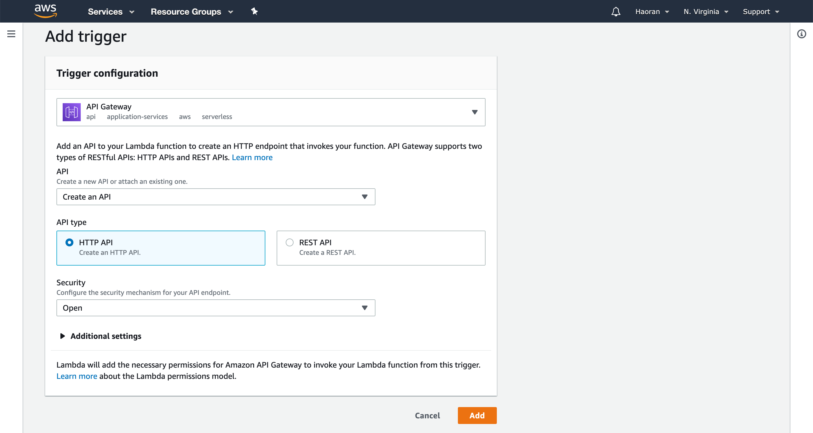

# Beldi

## Prerequisite

### Set up docker container
```
docker run -it docker.pkg.github.com/eniac/beldi/beldi:latest /bin/bash
```

> **All following operations are done inside the container.**

### Set AWS Credentials
```
$ aws configure
```
It will ask you for access key ID, secret access key, region and output format,
the first two can be found/created at


set region to be `us-east-1`, set output format to be `json`

## Running benchmark
### Notice for use
1. All scripts should be run at `~/beldi`
2. Try not kill the script halfway.
3. In some rare cases, it may take a long time for Dynamodb to delete a table.
If the script takes longer time than expected when initialization,
it's likely that it's waiting for deletion to finish.
4. All benchmark runs on HTTP, so an HTTP endpoint has to be manually set at AWS.
5. Running the entire benchmark real-world applications will cost hundreds of dollars.
So the provided script is to generate one single data point in the figure.
We recommend using the default setting, 100 requests/second.
6. The result may have some variance due to AWS, but the relative result is stable.

### Single Operation (Figure 11)
#### Time Estimation
The script has two modes
1. fast mode: less time, approximate result
2. full mode: full experiment

The script will ask you which mode to run when it starts.

1. fast: ~5 minutes
2. full: ~30 minutes

#### Running
```
$ pwd
/root/beldi
$ ./scripts/singleop/run.sh
```
Figure 11 includes three experiments, without-beldi, beldi and beldi-txn,
their function names are bsingleop, singleop and tsingleop  respectively.

After deployment, the script will ask for the HTTP endpoint for these three lambdas,
which need manual setup at AWS.

Take bsingleop as example

1. Go to the lambda console, click the function.


2. Click add trigger


3. Choose API Gateway


4. Configure as below


5. Click the trigger created


6. Copy the link and paste in terminal


After input all three endpoints, the experiment will start running.

The result will be saved at `~/beldi/result/singleop/singleop`, which can be loaded by gnuplot
```
$ gnuplot < scripts/singleop/singleop.pg
```
The figure will show up as `~/beldi/result/singleop/res.png`, use `docker cp` to copy it to host.

### Garbage Collection Test (Figure 14)
#### Time Estimation
1. fast: ~30 minutes
2. full: ~2.5 hours

#### Note
Fast mode only runs 5 minutes for each experiment, so the generated figure is incomplete

#### Running
```
$ ./scripts/gctest/run.sh
```
The script compiles and deploys the binary to aws.

After that, it will ask for the HTTP endpoint for `beldi-dev-gctest`.

The result will be saved as `~/beldi/result/gctest/gc`

To generate the figure,
```
$ gnuplot < scripts/gctest/gc.pg
```
The figure will show up as `~/beldi/result/gctest/res.png`

### Movie Review (Figure 12)
#### Time Estimation
Each takes ~20 minutes

#### Baseline
```
$ ./scripts/media/run-baseline.sh
```
will run the experiment without `beldi`.

The script will first ask you for request rate, default is 100,
You can try larger number if you have ample credits.

After deployment, it will ask HTTP endpoint for `beldi-dev-bFrontend`.

When it finishes, it will print to terminal the median and p99 latency for 100 requests/second,
also saved to `result/media/baseline.json`.

Alternatively, you can view the metrics at AWS CloudWatch.

#### Beldi
```
$ ./scripts/media/run.sh
```

### Travel Reservation (Figure 13)
#### Time Estimation
Each takes ~20 minutes

#### Baseline
```
$ ./scripts/hotel/run-baseline.sh
```
It will ask HTTP endpoint for `beldi-dev-bgateway`. (**NOT** beldi-dev-bfrontend)

When it finishes, it will print to terminal the median and p99 latency for 100 requests/second,
also saved to `result/hotel/baseline.json`.

#### Beldi
```
$ ./scripts/hotel/run.sh
```

## Cleanup
To avoid unexpected cost after experiments.

1. Check Dynamodb console and delete all tables if exists
2. Delete all lambdas, otherwise GC and collector will be triggered periodically.
(**DON'T** do this when running experiments).

## Trouble shooting
1. If deployment continues to fail, delete the stack at AWS CloudFormation and try again.
2. If the status of a table in DynamoDB remains `DELETING` for a long time, please wait until it finishes.
There's no way around it.