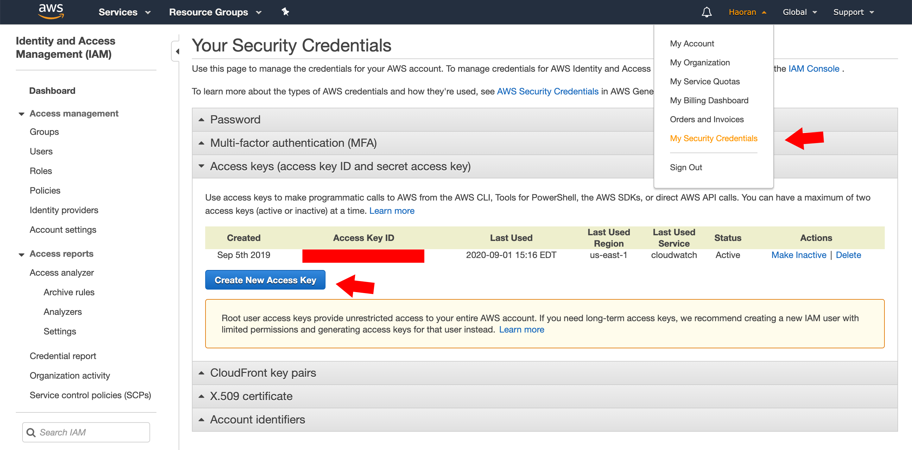
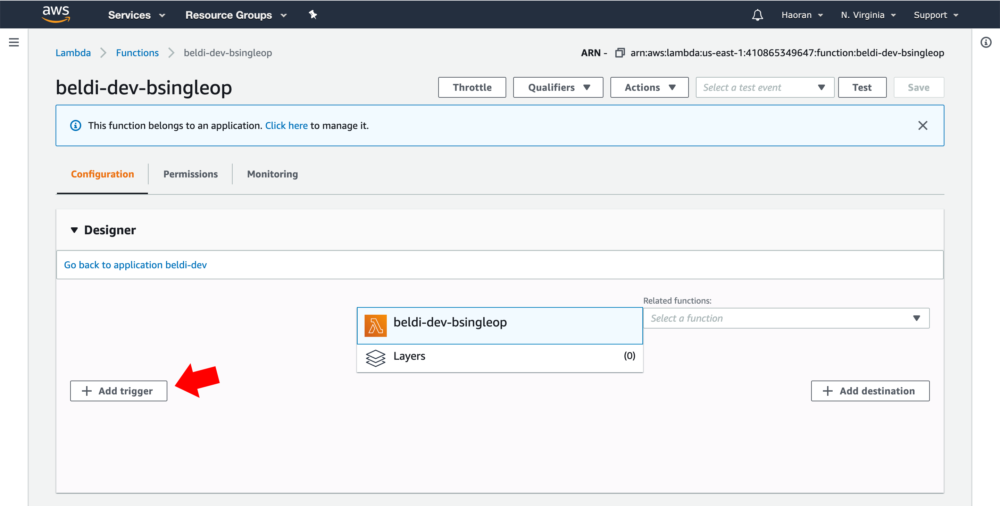
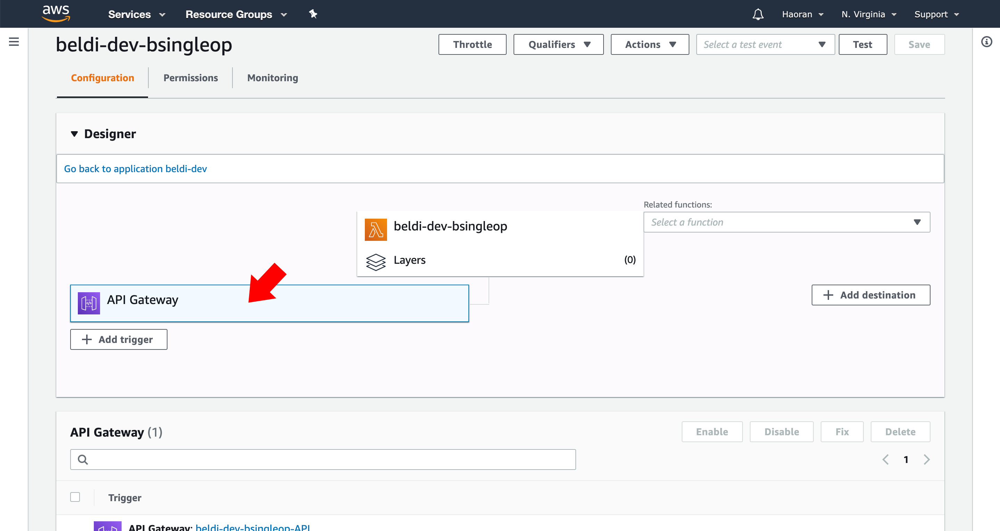

# Beldi

## Prerequisite

### Set up docker container
```
docker run -it tauta/beldi:0.1 /bin/bash
```

> **All following operations are done inside the container.**

### Set AWS Credentials
```
$ aws configure
```
It will ask you for access key ID, secret access key, region and output format,
the first two can be found/created at



set region to be `us-east-1`, set output format to be `json`

## Running benchmark
### Notice for use
1. All scripts should be run at `~/beldi`
2. Try not kill the script halfway.
3. In some rare cases, it may take a long time for AWS to delete a table.
If something weird happens, check Dynamodb management console and make sure it's clean
4. All benchmark runs on HTTP, so an HTTP endpoint has to be manually set at AWS.
5. Running the entire benchmark real-world applications will cost hundreds of dollars.
So the provided script is to generate one single data point in the figure.
We recommend using the default setting, 100 requests/second.

### Single Operation (Figure 11)
```
$ pwd
/root/beldi
$ ./scripts/singleop/run.sh
```
Figure 11 includes three experiments, without-beldi, beldi and beldi-txn,
their function names are bsingleop, singleop and tsingleop  respectively.

After deployment, the script will ask for the HTTP endpoint for these three lambdas.

Take bsingleop as example

1. Go to the lambda console, click the function.


2. Click add trigger


3. Choose API Gateway


4. Configure as below


5. Click the trigger created


6. Copy the link and paste in terminal


After input all three endpoints, the experiment will start running.
It will take around 1 hour to end.

The result is saved at `~/beldi/result/singleop/singleop`, which can be loaded by gnuplot
```
$ gnuplot < scripts/singleop/singleop.pg
```
The figure will show up as `~/beldi/result/singleop/res.png`

### Garbage Collection Test (Figure 14)
```
$ ./scripts/gctest/run.sh
```
The script compiles and deploys the binary to aws.

After that, it will ask for the HTTP endpoint for `beldi-dev-gctest`.

Then it takes around 2 hours to finish.

The result is saved as `~/beldi/result/gctest/gc`

To generate figure,
```
$ gnuplot < scripts/gctest/gc.pg
```
The figure will show up as `~/beldi/result/gctest/res.png`

### Movie Review (Figure 12)
#### Baseline
```
$ ./scripts/media/run-baseline.sh
```
will run the experiment without `beldi`.

The script will first ask you for request rate, default is 100,
You can try larger number if you have ample credits.

After deployment, it will ask HTTP endpoint for `beldi-dev-bFrontend`.

When it finishes, it will print to terminal the median and p99 latency for 100 requests/second,
also saved to `result/media/baseline.json`.

Alternatively, you can view the metrics at AWS CloudWatch.

#### Beldi
```
$ ./scripts/media/run.sh
```

### Travel Reservation (Figure 13)
#### Baseline
```
$ ./scripts/hotel/run-baseline.sh
```
It will ask HTTP endpoint for `beldi-dev-bGateway`.

When it finishes, it will print to terminal the median and p99 latency for 100 requests/second,
also saved to `result/hotel/baseline.json`.

#### Beldi
```
$ ./scripts/hotel/run.sh
```

## Cleanup
To avoid unexpected cost after experiments.

1. Check Dynamodb console and delete all tables if exists
2. Delete all lambdas, otherwise GC and collector will be triggered periodically.
(**DON'T** do this when running experiments).
